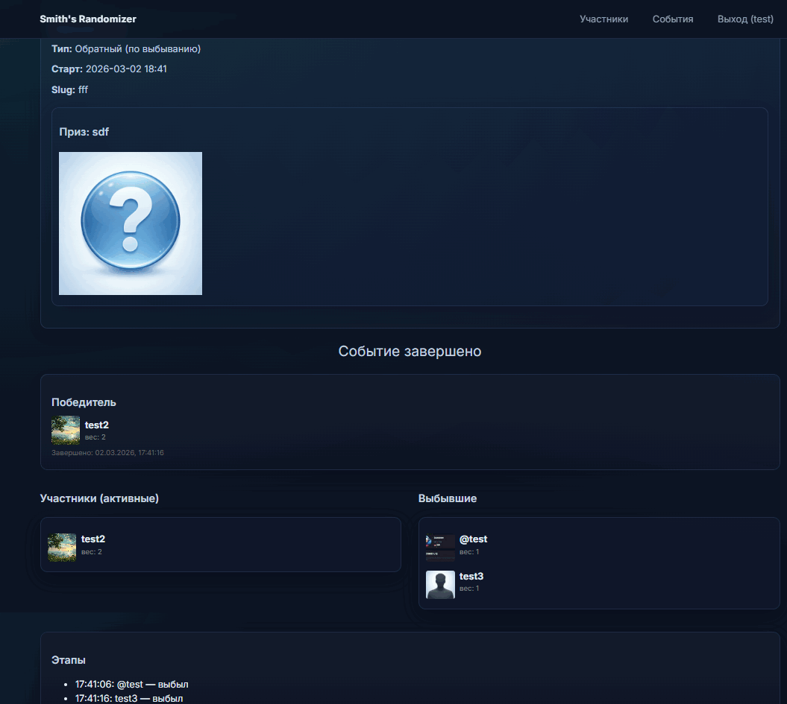

# Smith's Randomizer



Небольшое веб‑приложение на FastAPI для проведения розыгрышей/рандомайзера:
- Создание событий (розыгрышей) с датой старта и описанием.
- Управление участниками и их «весами» (вероятностями).
- Два типа розыгрыша: прямой выбор победителя и обратный (выбывание до победителя).
- Публичная страница события, веб‑сокеты для обновления статуса в реальном времени.
- Админка для управления пользователями, участниками и событиями.

Приложение использует:
- FastAPI + Jinja2 (серверные шаблоны для HTML‑страниц)
- SQLModel (SQLite по умолчанию)
- Uvicorn (ASGI‑сервер)
- aiofiles, aiosqlite, python‑multipart (загрузка файлов)


## Требования
- Python 3.11+ (рекомендуется 3.11 или новее)
- Windows/PowerShell или любая другая ОС с установленным Python


## Установка
Выполните в PowerShell из корня проекта:

```powershell
# 1) (необязательно) создать и активировать виртуальное окружение
python -m venv .venv
.\.venv\Scripts\Activate.ps1

# 2) установить зависимости
pip install -r requirements.txt
```


## Переменные окружения
Можно задать через PowerShell перед запуском:

- ENV — среда работы; значения: `dev` (по умолчанию) или `prod`.
  - В `dev` доступны Swagger (/docs), ReDoc (/redoc), OpenAPI (/openapi.json).
  - В `prod` приложение монтируется по префиксу `/randomizer` и отключает публичную документацию.
- HOST — адрес прослушивания (по умолчанию `127.0.0.1`).
- PORT — порт (по умолчанию `8000`).
- RELOAD — авто‑перезагрузка кода: `1/true/yes/on` включает, по умолчанию включено в dev.
- SECRET_KEY — секрет для cookie‑сессий (по умолчанию dev‑значение, обязательно замените в prod!).
- DATABASE_URL — строка подключения (по умолчанию `sqlite+aiosqlite:///data/database.db`).
- SUPER_ADMIN_USERNAME — имя супер‑админа для авто‑создания при первом запуске.
- SUPER_ADMIN_PASSWORD — пароль супер‑админа для авто‑создания при первом запуске.

Пример (PowerShell):
```powershell
$env:ENV = "dev"
$env:SECRET_KEY = "change-me-please"
$env:SUPER_ADMIN_USERNAME = "admin"
$env:SUPER_ADMIN_PASSWORD = "admin123"
```


## Запуск (локально)
Есть два основных способа.

1) Через main.py (удобно в разработке):
```powershell
python main.py
# или с параметрами
$env:HOST="0.0.0.0"; $env:PORT="8000"; $env:RELOAD="1"; python main.py
```

2) Напрямую через uvicorn:
```powershell
uvicorn app.app:app --host 0.0.0.0 --port 8000 --reload
```

После запуска:
- Главная страница: http://127.0.0.1:8000/
- Документация Swagger (в dev): http://127.0.0.1:8000/docs

Если `ENV=prod`, приложение будет доступно по префиксу `/randomizer`.


## Структура проекта (основное)
```
app/
  __init__.py           # экспорт объекта FastAPI (app)
  app.py                # создание приложения, шаблоны, статика, роутеры, планировщик
  auth.py               # функции аутентификации и сессий
  db.py                 # инициализация БД, сессии, авто‑создание супер‑админа
  models.py             # модели SQLModel
  routers/              # набор роутов (auth, participants, events, admin, public)
  security.py           # хэширование паролей и проверка
  static/               # статика (css/js/img/uploads)
  templates/            # Jinja2 шаблоны страниц
asgi.py                 # точка импорта для ASGI (from app import app)
main.py                 # удобный entrypoint для uvicorn.run
requirements.txt        # зависимости
```


## Основные URL
- / — главная страница
- /login — вход
- /register — регистрация
- /participants — управление участниками
- /events — управление событиями
- /admin — админка
- /event/{slug} — публичная страница события
- /api/events/{id}/state — публичное API состояния события


## Быстрая проверка
1. Задайте переменные окружения для супер‑админа (см. выше).
2. Запустите приложение (python main.py).
3. Перейдите на /login и войдите под SUPER_ADMIN_USERNAME.
4. Создайте участников и событие.
5. Откройте публичную страницу события /event/{slug} во второй вкладке — статус будет обновляться в реальном времени.


## Деплой (кратко)
- Установите переменные окружения `ENV=prod`, уникальный `SECRET_KEY`, свой `DATABASE_URL` (если нужно), SUPER_ADMIN_* при первом запуске.
- Запускайте через процесс‑менеджер (например, systemd, pm2, Supervisor) командой `uvicorn app.app:app --host 0.0.0.0 --port 8000`.
- При публикации за reverse‑proxy (Nginx/Caddy) учтите возможный префикс `/randomizer` в prod.


## Лицензия
Не указана. При необходимости добавьте файл LICENSE.
